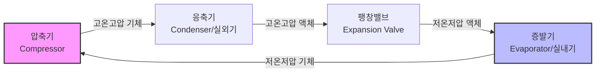

# 🌬️ 에어컨 종류 및 분류 (AC Classification)

> [!abstract] 카테고리
> **공조·청정**

에어컨은 설치 방식, 냉각 용량, 그리고 열전달 매체에 따라 다양하게 분류됩니다. 본 문서는 PROCUREMENT 및 기술 검토를 위한 상세 분류 체계를 다룹니다.

---

## 🏗️ 냉동 사이클 기본 원리

에어컨은 냉매의 상태 변화를 이용해 열을 이동시키는 **증기 압축 냉동 사이클(Vapor Compression Cycle)**을 따릅니다.

---

## 📊 상세 분류 및 기술 사양 비교

| 유형 | 약어 | 열전달 방식 (실내↔실외) | 주요 특징 및 용도 | 비고 |
| :--- | :--- | :--- | :--- | :--- |
| **룸 에어컨** | **RAC** | 공기 ↔ 공기 | 벽걸이/창문형. 가정용(6~15평) 표준 | 소형, 개별제정 |
| **패키지형** | **PAC** | 공기 ↔ 공기 | 스탠드형. 상업용(15~180평) 중대형 | 상가, 오피스 |
| **바닥 거치형** | **FAC** | 공기 ↔ 공기 | 지면 직접 설치형 패키지 모델 | 대강당, 산업현장 |
| **창문형** | **WAC** | 공기 ↔ 공기 | 일체형(실내외기 통합). 자가설치 가능 | 임대주택 등 |
| **중앙공조** | **CAC** | 공기 ↔ 공기 (덕트) | 건물 전체 배관/덕트 방식 | 대형 빌딩, 호텔 |
| **멀티형** | **VRF** | 공기 ↔ 공기 (냉매분배) | 1대 실외기 + 다수 실내기 개별제어 | 오피스 빌딩 표준 |
| **서버실용** | **CRAC** | 공기 ↔ 공기/물 | 항온항습기. 데이터센터 정밀 온도제어 |  |
| **칠러** | **Chiller** | 물 ↔ 냉매 ↔ 공기/물 | 냉수 순환 방식의 대규모 중앙 냉방 | 수냉식/공냉식 |
| **히트펌프** | **EHS** | 공기 ↔ 물 / 공기 | 냉방 + 난방 + 온수 통합 시스템 | 유럽형 에너지 절감형 |

---

## 🔍 기술적 심화 분석

### 🏢 VRF (Variable Refrigerant Flow)
하나의 실외기에 다양한 형태(벽걸이, 카세트, 덕트 등)의 실내기를 연결하고, 전자식 팽창밸브(EEV)를 통해 실별 냉매 유량을 제어하는 지능형 시스템입니다.

### 🖥️ CRAC (Computer Room Air Conditioning)
일반 에어컨과 달리 **현열비(Sensible Heat Ratio)**가 매우 높으며, 습도 제어(Humidifier) 기능이 포함되어 서버 운영에 최적화된 환경을 제공합니다.

### 💧 Chiller (칠러) 시스템
냉매가 직접 실내로 들어오는 대신, 칠러에서 냉각된 **'냉수(Chilled Water)'**가 빌딩 내부의 AHU(공기조화기)나 FCU(팬코일유닛)로 순환하며 냉방을 수행합니다.

> [!important] 구매 실무 포인트 (Buying Point)
> 1. **용량 산정:** 설치 공간의 부하량에 따른 적정 용량 선정 (RAC/PAC)
> 2. **효율 등급:** 초기 투자비 대비 운전 비용(LCC) 분석 필요
> 3. **냉매 트렌드:** GWP(지구온난화지수)가 낮은 R32, R290 적용 여부 확인

---
**관련 항목:** [[에어컨 효율]], [[압축기]], [[냉매]], [[ESG 규제 및 인증]]
